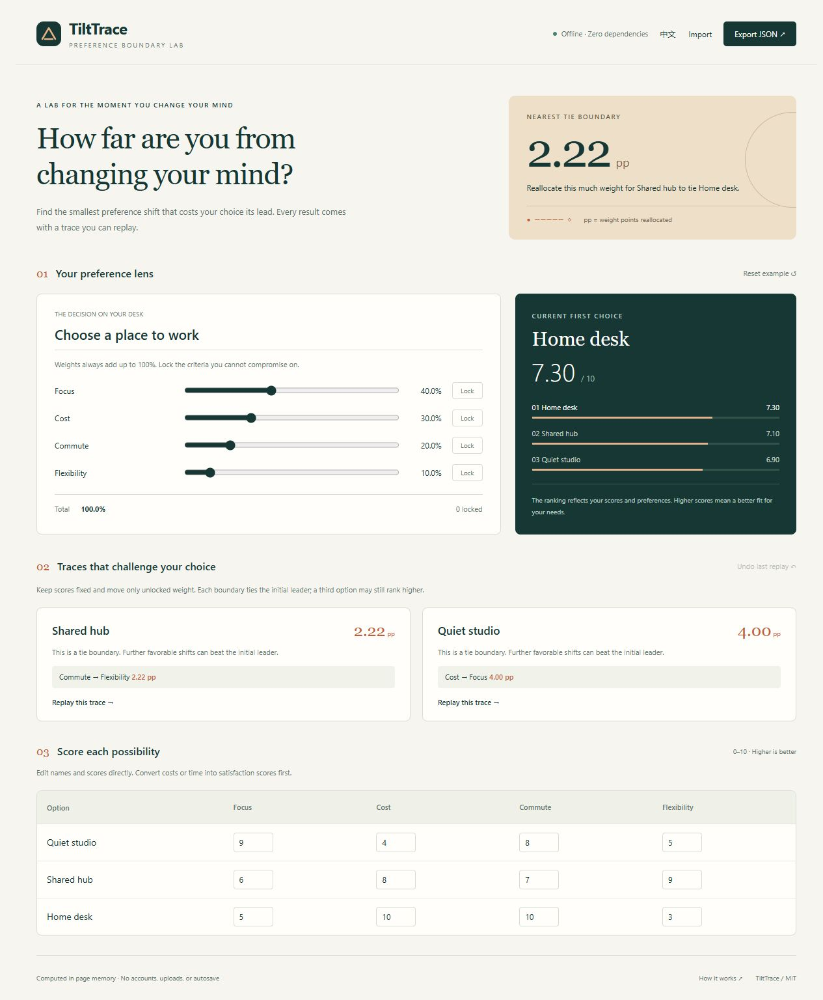

# TiltTrace

A zero-dependency, offline decision sensitivity lab.

**How little would your priorities need to change for your first choice to lose its lead?**

[简体中文](README_ZH.md) · [Start](#start) · [Example](#example) · [Data format](#data-format) · [Method](docs/METHOD.md) · [Tests](#tests)



TiltTrace is a small, offline decision sensitivity lab. Score your options, assign weights, and inspect the smallest weight redistribution that lets each challenger catch the current leader. Every reachable result includes a concrete set of weights you can apply and check.

**中文简介：** TiltTrace 是零依赖的离线决策敏感性实验室，计算让其他方案追平当前首选所需的最少权重重分配，并提供可复验的权重见证。

## Why TiltTrace

- **Minimum redistribution:** a result such as “2.22 pp” means moving 2.22 percentage points of weight between criteria, keeping the total at 100%.
- **Locked priorities:** keep selected criterion weights fixed while exploring the rest.
- **Replayable results:** inspect the transfer list, apply its weights, compare the ranking, and undo the preview.
- **Local and compact:** plain HTML, CSS, and JavaScript; no packages, build step, CDN, network requests, telemetry, or persistent storage.
- **Portable decisions:** English/Chinese interface and explicit JSON import/export.

Weighted scoring and sensitivity analysis already exist. TiltTrace's focus is their combination with a conserved weight total, locks, minimum total-variation distance, and replayable numerical witnesses. It does not claim a new mathematical algorithm.

<a id="start"></a>
## Start

1. Download the repository ZIP and extract it.
2. Double-click `index.html` to open it in a modern browser. You can disconnect from the network.
3. Rename the decision, criteria, and options; edit scores and move the weight sliders.
4. Lock any fixed weights, then inspect a challenger's catch-up boundary and preview its witness.
5. Export JSON to keep your work. Refreshing or closing the page discards the in-memory decision.

All scores are subjective ratings from **0 to 10, with higher always better**. For `Cost`, rate affordability or satisfaction rather than entering a price. For `Commute`, a higher score means a better commute. Changing a weight redistributes the remaining unlocked weights proportionally; if they are all zero, the remainder is shared equally.

The first version edits the existing rows in the interface. To change the number of options or criteria, import a JSON model with 2–8 of each.

<a id="example"></a>
## Example: Choose a place to work

This is a synthetic demonstration, not a recommendation about real workplaces.

| Option | Focus · 40% | Cost · 30% | Commute · 20% | Flexibility · 10% | Weighted score |
| --- | ---: | ---: | ---: | ---: | ---: |
| Quiet studio | 9 | 4 | 8 | 5 | 6.9 |
| Shared hub | 6 | 8 | 7 | 9 | 7.1 |
| Home desk | 5 | 10 | 10 | 3 | 7.3 |

Home desk leads. Shared hub can catch it by moving **20/9 ≈ 2.22 pp from Commute to Flexibility**. The witness weights are approximately `[40, 30, 17.777778, 12.222222]`; both options then score approximately `7.144444`.

This is a **tie boundary**, not a weight setting that strictly wins. A result's `canWin` flag means the challenger can strictly exceed the baseline leader somewhere within the allowed weight space. A **tie-only** result can reach equality but cannot strictly exceed it. An **unreachable** result cannot even tie under the current locks.

Each comparison is against the leader at the start of that calculation. Catching that leader does **not** guarantee becoming the overall winner: another option may score higher at that witness. Always inspect the full replayed ranking.

<a id="data-format"></a>
## Data format

Import accepts a UTF-8 JSON file of at most **64 KiB (65,536 bytes)**. The model supports **2–8 criteria and 2–8 options**; every option has exactly one score per criterion. Weights are finite numbers from 0 to 100, sum to 100 within `1e-7`, and may include zero. Scores are finite numbers from 0 to 10. Titles are 1–120 characters; criterion and option names are 1–60 characters. `locked` is a boolean. Unknown schema versions and invalid models are rejected; unrecognized fields are discarded.

```json
{
  "schemaVersion": 1,
  "title": "Choose a place to work",
  "criteria": [
    { "name": "Focus", "weight": 40, "locked": false },
    { "name": "Cost", "weight": 30, "locked": false },
    { "name": "Commute", "weight": 20, "locked": false },
    { "name": "Flexibility", "weight": 10, "locked": false }
  ],
  "options": [
    { "name": "Quiet studio", "scores": [9, 4, 8, 5] },
    { "name": "Shared hub", "scores": [6, 8, 7, 9] },
    { "name": "Home desk", "scores": [5, 10, 10, 3] }
  ]
}
```

## Interpreting the result

The distance is **total variation**, half the sum of absolute weight changes. Moving 3 pp from one criterion to another has distance **3 pp**, not 6 pp. It measures sensitivity to your weights while keeping scores fixed. It is neither a probability of being wrong nor confidence in a real-world outcome.

An existing tie has distance zero. Locks can make a challenger unreachable. Numerical comparisons use a small tolerance; displayed rounded weights may not reproduce an exact tie. Use Replay to apply the full witness, then export the replayed model to retain its full-precision weights. See the [method, proof, and limits](docs/METHOD.md).

<a id="tests"></a>
## Tests

With **Node.js 20 or newer**, run:

```sh
npm test
```

No `npm install` is needed. Tests use Node's built-in test runner. GitHub Actions runs the same command without installing packages. Node is only needed for development tests, not for opening the app.

## License

[MIT](LICENSE) · Copyright (c) 2026 [cloudwallker](https://github.com/cloudwallker)

## Interface

An offline preference-boundary lab with readable decision traces, larger controls, visible keyboard focus, and layouts that adapt to small screens.
